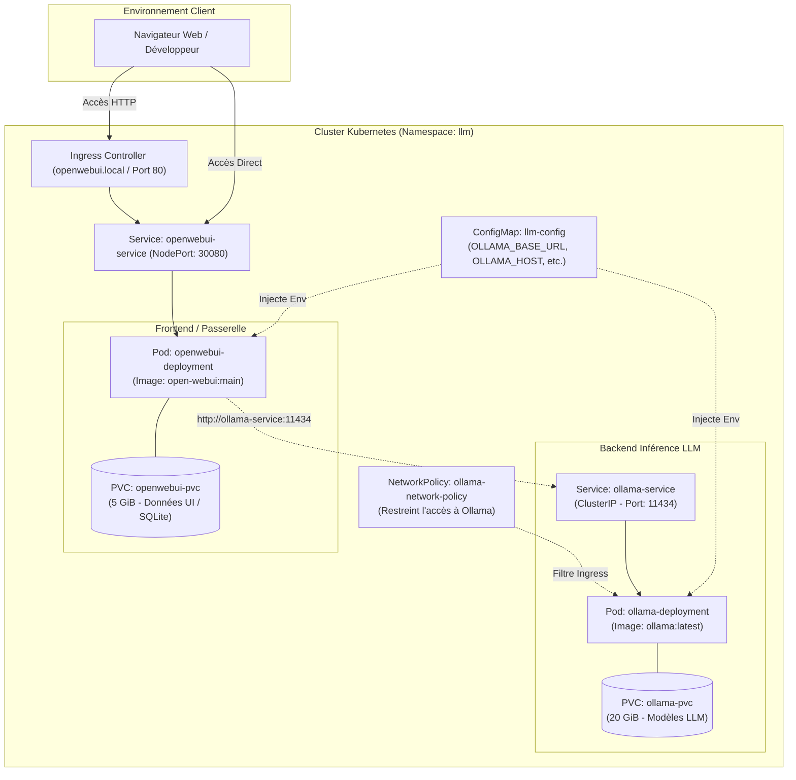
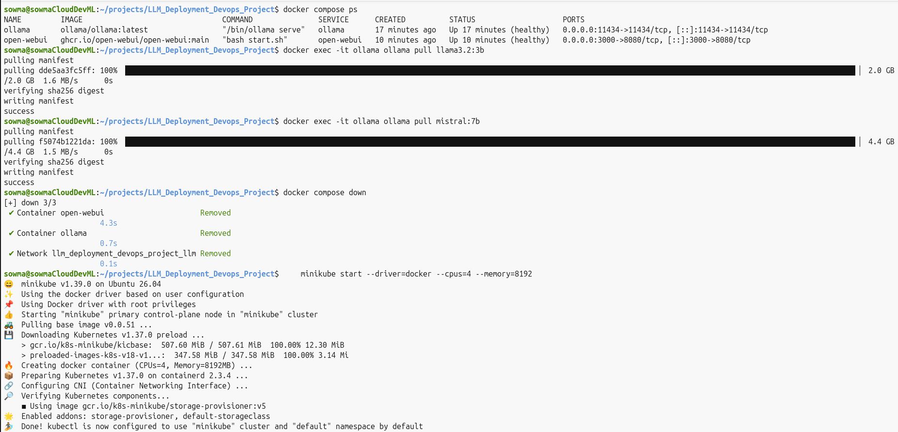
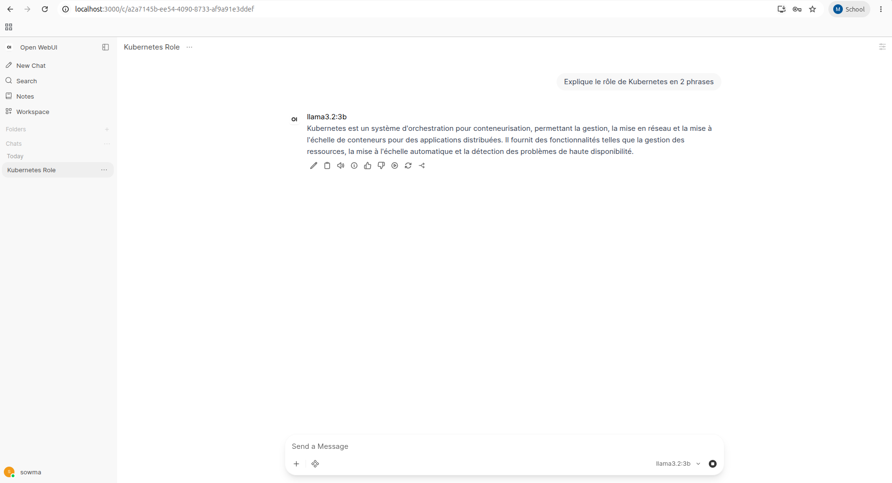
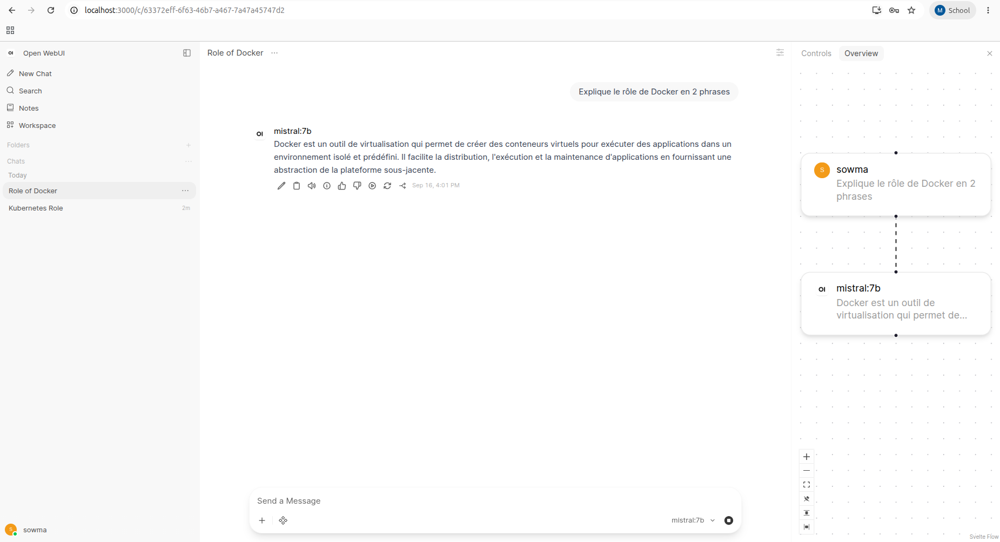
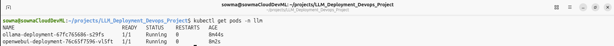
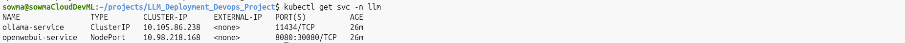
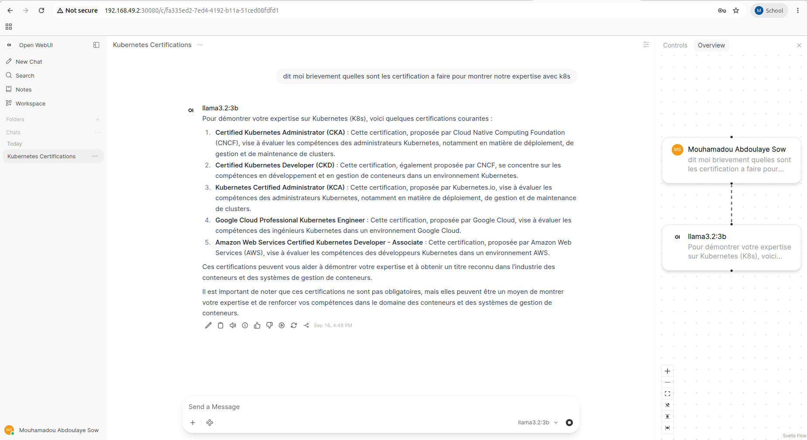
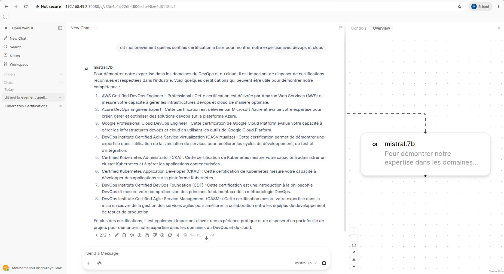
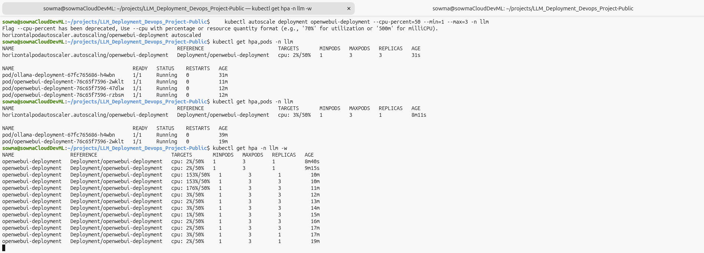
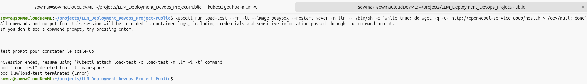

# Rapport de Projet DevOps : Déploiement et Orchestration d'un Grand Modèle de Langage (LLM)

---

**Auteur :** Mouhamadou Abdoulaye Sow (DIC2 - Informatique)  
**Projet :** Déploiement et Orchestration d'un LLM Open-Source avec Docker Compose et Kubernetes  
**Enseignant :** M. Ibrahima Mbengue  
**Dépôt GitHub :** [https://github.com/cloudDevML/LLM_Deployment_Devops_Project-Public](https://github.com/cloudDevML/LLM_Deployment_Devops_Project-Public)  
**Date :** Septembre 2026  

---

## Résumé Exécutif

Ce projet documente la conception, la conteneurisation, le déploiement local et l'orchestration en cluster d'une infrastructure d'Intelligence Artificielle générative basée sur des modèles de langage open-source (*Large Language Models* - LLMs).

L'architecture intègre deux composants majeurs :
1. **Ollama** : moteur d'inférence optimisé pour exécuter localement des modèles de fondation (LLaMA 3.2 et Mistral 7B).
2. **Open WebUI** : interface utilisateur interactive fournissant un environnement de chat fluide similaire à ChatGPT ou Gemini.

Le cycle complet du projet a été mené avec succès en deux grandes phases :
- **Phase 1 (Développement & Prototypage)** : Déploiement multi-conteneurs local via **Docker Compose**, gestion des volumes et validation de l'inférence.
- **Phase 2 (Production & Orchestration)** : Migration vers un cluster **Kubernetes (Minikube)** avec application rigoureuse des standards de production (Namespaces, ConfigMaps, Persistent Volume Claims, Health Probes, Limites de ressources, Ingress, NetworkPolicy et HPA).

Toutes les étapes ont été validées par des tests d'inférence réels et documentées à l'aide de captures d'écran intégrées dans ce rapport.

---

## Table des Matières

1. [Architecture Globale du Système](#1-architecture-globale-du-système)
2. [Partie 1 : Déploiement Local avec Docker Compose](#2-partie-1--déploiement-local-avec-docker-compose)
   - [2.1 Configuration et Spécifications](#21-configuration-et-spécifications)
   - [2.2 Démarrage et Validation des Conteneurs](#22-démarrage-et-validation-des-conteneurs)
   - [2.3 Téléchargement et Tests d'Inférence (LLaMA & Mistral)](#23-téléchargement-et-tests-dinférence-llama--mistral)
3. [Partie 2 : Déploiement et Orchestration sur Kubernetes](#3-partie-2--déploiement-et-orchestration-sur-kubernetes)
   - [3.1 Préparation du Cluster Minikube](#31-préparation-du-cluster-minikube)
   - [3.2 Déploiement Déclaratif des Manifestes](#32-déploiement-déclaratif-des-manifestes)
   - [3.3 Validation de l'État des Pods et Services](#33-validation-de-létat-des-pods-et-services)
   - [3.4 Inférence et Démonstration des Modèles sous Kubernetes](#34-inférence-et-démonstration-des-modèles-sous-kubernetes)
4. [Analyse Technique Approfondie](#4-analyse-technique-approfondie)
   - [4.1 Rôle et Utilité de Chaque Ressource Kubernetes](#41-rôle-et-utilité-de-chaque-ressource-kubernetes)
   - [4.2 Communication Réseau Inter-Services et Découverte DNS](#42-communication-réseau-inter-services-et-découverte-dns)
   - [4.3 Persistance des Données et Rôle Critique des PVC](#43-persistance-des-données-et-rôle-critique-des-pvc)
   - [4.4 Mécanismes de Surveillance et Sondes de Santé (Probes)](#44-mécanismes-de-surveillance-et-sondes-de-santé-probes)
   - [4.5 Étude Comparative : Docker Compose vs Kubernetes](#45-étude-comparative--docker-compose-vs-kubernetes)
5. [Fonctionnalités Avancées et Bonus Implémentés](#5-fonctionnalités-avancées-et-bonus-implémentés)
6. [Défis Rencontrés et Solutions Apportées](#6-défis-rencontrés-et-solutions-apportées)
7. [Conclusion](#7-conclusion)

---

## 1. Architecture Globale du Système

L'application suit le patron architectural microservices découplé :



- **Open WebUI** gère la session utilisateur, l'historique de chat, la mise en page et les requêtes vers le backend d'inférence.
- **Ollama** charge les poids quantifiés des LLMs en mémoire RAM/VRAM et exécute les calculs tensoriels à la réception des requêtes `/api/generate` ou `/api/chat`.

---

## 2. Partie 1 : Déploiement Local avec Docker Compose

### 2.1 Configuration et Spécifications
Le fichier `docker-compose.yaml` orchestre les deux conteneurs sur un réseau bridge dédié nommé `llm` :
- **Ollama** :
  - Image : `ollama/ollama:latest`
  - Port exposé : `11434:11434`
  - Volume persistant : `ollama:/root/.ollama`
  - Healthcheck : `ollama list`
- **Open WebUI** :
  - Image : `ghcr.io/open-webui/open-webui:main`
  - Port exposé : `3000:8080`
  - Dépendance : `depends_on: ollama (condition: service_healthy)`
  - Variable d'environnement : `OLLAMA_BASE_URL=http://ollama:11434`
  - Volume persistant : `open-webui:/app/backend/data`
  - Healthcheck : `curl -f http://localhost:8080/health || exit 1`

### 2.2 Démarrage et Validation des Conteneurs
Le démarrage est exécuté via :
```bash
docker compose up -d
docker compose ps
```

La capture ci-dessous illustre le lancement de l'infrastructure Docker et la confirmation du statut opérationnel des deux conteneurs (`ollama` et `open-webui`) :

<div align="center">
  
  <p><em>Figure 1 : Démarrage des conteneurs via Docker Compose et initialisation de l'environnement Minikube.</em></p>
</div>

### 2.3 Téléchargement et Tests d'Inférence (LLaMA & Mistral)
Une fois les conteneurs en état sain (*healthy*), les modèles LLM ont été téléchargés dans le conteneur Ollama :
```bash
docker exec -it ollama ollama pull llama3.2:3b
docker exec -it ollama ollama pull mistral:7b
```

#### Test 1 : Inférence avec LLaMA 3.2 (3B)
L'accès à l'interface s'effectue sur `http://localhost:3000`. Un prompt technique a été envoyé au modèle **LLaMA 3.2** :

<div align="center">
  
  <p><em>Figure 2 : Interface Open WebUI sous Docker Compose – Inférence réussie avec le modèle LLaMA 3.2.</em></p>
</div>

#### Test 2 : Inférence avec Mistral (7B)
Le modèle **Mistral 7B** a ensuite été sélectionné et sollicité avec une requête complexe :

<div align="center">
  
  <p><em>Figure 3 : Interface Open WebUI sous Docker Compose – Inférence réussie avec le modèle Mistral 7B.</em></p>
</div>

Les deux modèles répondent de manière cohérente, confirmant le bon fonctionnement du bridge Docker et de l'API REST d'Ollama.

---

## 3. Partie 2 : Déploiement et Orchestration sur Kubernetes

### 3.1 Préparation du Cluster Minikube
Le cluster Minikube a été configuré avec les allocations de ressources nécessaires pour supporter les charges de calcul requises par les LLMs :
```bash
minikube start --driver=docker --cpus=4 --memory=8192
minikube addons enable ingress
minikube addons enable metrics-server
```

### 3.2 Déploiement Déclaratif des Manifestes
Tous les manifestes Kubernetes ont été packagés avec **Kustomize** pour permettre un déploiement atomique :
```bash
kubectl apply -k k8s/
```
Cette commande unique applique l'ensemble des 10 manifestes : Namespace, ConfigMap, PVCs, Deployments, Services, Ingress, NetworkPolicy et HPA.

### 3.3 Validation de l'État des Pods et Services

#### Validation des Pods
La commande suivante permet de vérifier l'état d'ordonnancement et d'exécution des conteneurs :
```bash
kubectl get pods -n llm
```

<div align="center">
  
  <p><em>Figure 4 : Statut des Pods Kubernetes – ollama et open-webui en statut Running avec 1/1 READY.</em></p>
</div>

> [!NOTE]
> Comme visible sur la capture ci-dessus, aucun pod n'est en état `CrashLoopBackOff` ou `Pending`. Les deux pods affichent `1/1 READY`, validant le passage avec succès des sondes de démarrage (*Startup Probes*) et de préparation (*Readiness Probes*).

#### Validation des Services
La commande d'inspection réseau confirme l'exposition des services :
```bash
kubectl get svc -n llm
```

<div align="center">
  
  <p><em>Figure 5 : Services Kubernetes – ollama-service (ClusterIP) et openwebui-service (NodePort: 30080).</em></p>
</div>

- **`ollama-service`** : Service interne `ClusterIP` écoutant sur le port standard `11434`.
- **`openwebui-service`** : Service `NodePort` exposant l'application sur le port `30080` de tous les nœuds du cluster.

### 3.4 Inférence et Démonstration des Modèles sous Kubernetes
Après avoir attaché les volumes persistants et chargé les modèles dans le pod `ollama-deployment` :
```bash
OLLAMA_POD=$(kubectl get pod -n llm -l app=ollama -o jsonpath='{.items[0].metadata.name}')
kubectl exec -it -n llm $OLLAMA_POD -- ollama pull llama3.2:3b
kubectl exec -it -n llm $OLLAMA_POD -- ollama pull mistral:7b
```

L'application a été accédée via l'IP du cluster Minikube (`http://192.168.49.2:30080`).

#### Démonstration Modèle 1 : LLaMA 3.2 sous Kubernetes
<div align="center">
  
  <p><em>Figure 6 : Inférence en production sur Kubernetes – Modèle LLaMA 3.2 interagissant via le service interne.</em></p>
</div>

#### Démonstration Modèle 2 : Mistral 7B sous Kubernetes
<div align="center">
  
  <p><em>Figure 7 : Inférence en production sur Kubernetes – Modèle Mistral 7B sous orchestration Kubernetes.</em></p>
</div>

---

## 4. Analyse Technique Approfondie

### 4.1 Rôle et Utilité de Chaque Ressource Kubernetes

| Ressource Kubernetes | Spécification dans le Projet | Rôle Technique & Justification Opérationnelle |
| :--- | :--- | :--- |
| **Namespace (`llm`)** | `apiVersion: v1` | Fournit une frontière d'isolation logique stricte. Empêche les collisions de noms avec d'autres workloads et permet d'appliquer des politiques RBAC et réseau ciblées. |
| **ConfigMap (`llm-config`)** | `apiVersion: v1` | Centralise les variables d'environnement non sensibles (`OLLAMA_BASE_URL`, `OLLAMA_HOST`, etc.). Garantit le principe 12-Factor App en séparant configuration et code conteneurisé. |
| **PVC Ollama (`ollama-pvc`)** | `20Gi`, `ReadWriteOnce` | Réserve dynamiquement du stockage bloc persistant via le StorageClass `standard` (hostpath). Indispensable pour conserver les gigaoctets de poids des modèles LLM. |
| **PVC WebUI (`openwebui-pvc`)** | `5Gi`, `ReadWriteOnce` | Conserve l'état applicatif : comptes utilisateurs, sessions JWT, bases SQLite de métadonnées et embeddings vectoriels. |
| **Deployment Ollama** | `replicas: 1`, `Burstable` | Contrôleur déclaratif garantissant la disponibilité continue du moteur d'inférence, avec redémarrage automatique en cas de crash et gestion des sondes. |
| **Deployment Open WebUI** | `replicas: 1`, `strategy: Recreate` | Déploie et supervise l'interface graphique. Déclare des requêtes/limites adaptées pour l'autoscaling horizontal. |
| **Service Ollama (`ollama-service`)** | `ClusterIP: 11434` | Fournit une adresse IP virtuelle privée et stable avec équilibrage de charge L4 interne. Inaccessible depuis l'extérieur du cluster. |
| **Service WebUI (`openwebui-service`)** | `NodePort: 30080 / 8080` | Ouvre un port d'écoute externe sur chaque nœud du cluster, permettant aux utilisateurs d'accéder au frontend via l'adresse IP du cluster. |
| **Ingress (`openwebui-ingress`)** | `host: openwebui.local` | Passerelle applicative HTTP de niveau 7 (L7). Fournit le routage basé sur les noms d'hôtes et le déchargement SSL potentiel. |

---

### 4.2 Communication Réseau Inter-Services et Découverte DNS

Dans un cluster Kubernetes dynamique, les adresses IP des Pods changent constamment à chaque recréation, mise à l'échelle ou redémarrage de nœud.

```text
[Pod Open WebUI]
       │
       ▼ (Requête HTTP vers "http://ollama-service:11434")
[CoreDNS Cluster Resolver]
       │ Résolution de "ollama-service.llm.svc.cluster.local" ──► IP Virtuelle: 10.105.86.238
       ▼
[Kube-Proxy (iptables / IPVS)]
       │ Routage transparent du trafic L4 vers le Pod actif
       ▼
[Pod Ollama (172.17.0.x:11434)]
```

1. **Enregistrement DNS automatique** : Lors de la création du Service `ollama-service` dans le namespace `llm`, le serveur **CoreDNS** du cluster enregistre automatiquement le nom pleinement qualifié (FQDN) :
   $$\text{ollama-service.llm.svc.cluster.local}$$
2. **Configuration découplée** : Open WebUI lit la variable `OLLAMA_BASE_URL` depuis la **ConfigMap** (`http://ollama-service:11434`).
3. **Traduction d'adresse (NAT) via Kube-Proxy** : Lorsque WebUI émet un appel HTTP, le composant `kube-proxy` intercepte les paquets destinés à la `ClusterIP` (10.105.86.238) et les transfère directement vers le point de terminaison (*Endpoint*) du conteneur Ollama sain.

---

### 4.3 Persistance des Données et Rôle Critique des PVC

Les conteneurs Docker et Kubernetes sont par nature **stateless** et **éphémères** : toute écriture sur le système de fichiers local du conteneur réside dans une couche d'écriture temporaire (*writable container layer*) qui est détruite à l'arrêt du pod.

#### Justification pour Ollama
Les modèles de langage représentent des volumes de données considérables :
- LLaMA 3.2 (3B) : $\approx 2.0\text{ Go}$
- Mistral (7B) : $\approx 4.1\text{ Go}$
- DeepSeek R1 (8B) : $\approx 4.9\text{ Go}$

Sans **PersistentVolumeClaim (PVC)** monté sur `/root/.ollama` :
- Tout redémarrage du pod consécutif à une mise à jour ou un dépassement de mémoire (OOMKilled) obligerait le cluster à retélécharger l'ensemble des modèles depuis internet.
- Cela provoquerait une saturation réseau et une indisponibilité prolongée du service (plusieurs dizaines de minutes).

#### Justification pour Open WebUI
Le montage d'un PVC sur `/app/backend/data` assure la persistance :
- Des comptes administrateurs et utilisateurs enregistrés.
- De l'historique complet des conversations et contextes de prompts.
- De la base SQLite locale et des modèles d'embeddings vectoriels (`all-MiniLM-L6-v2`).

---

### 4.4 Mécanismes de Surveillance et Sondes de Santé (Probes)

Kubernetes implémente une boucle de contrôle active (*reconciliation loop*) basée sur trois sondes complémentaires :

```text
Chronologie du Cycle de Vie d'un Pod
─────────────────────────────────────────────────────────────────────────────►
  1. Démarrage du conteneur
     │
     ├──► [Startup Probe] ── (Vérifie si l'application démarre)
     │       └── Échecs ignorés jusqu'à failureThreshold (30 x 5s = 150s max)
     │       └── Succès ──► Passe le relais aux sondes Liveness & Readiness
     │
  2. Fonctionnement en régime établi
     │
     ├──► [Readiness Probe] ── (Vérifie si le Pod peut recevoir du trafic)
     │       ├── Succès : Le Pod reste dans la liste des Endpoints du Service
     │       └── Échec  : Le Pod est retiré du Service (évite les erreurs 502/503)
     │
     └──► [Liveness Probe]  ── (Vérifie si le processus ne s'est pas bloqué)
             ├── Succès : Aucune action requise
             └── Échec  : Kubelet tue le conteneur et le redémarre automatiquement
```

#### 1. Startup Probe (`/api/version` pour Ollama, `/health` pour WebUI)
- **Problème résolu** : Les moteurs d'IA mettent du temps à allouer la mémoire RAM/GPU et charger les bibliothèques d'inférence. Si seule une *Liveness Probe* classique était configurée avec un court délai, Kubernetes tuerait prématurément le conteneur avant qu'il n'ait terminé son initialisation (*restart loop*).
- **Configuration retenue** : `initialDelaySeconds: 5`, `periodSeconds: 5`, `failureThreshold: 30` (accorde jusqu'à 150 secondes pour démarrer sereinement).

#### 2. Readiness Probe
- **Rôle** : Détermine si le conteneur est apte à répondre aux requêtes des utilisateurs.
- **Effet en cas d'échec** : Le Pod **n'est pas redémarré**, mais son adresse IP est temporairement retirée de l'équilibreur de charge du Service pour protéger les utilisateurs contre des erreurs d'indisponibilité.

#### 3. Liveness Probe
- **Rôle** : Détecte les blocages profonds (*deadlocks*) où le processus semble tourner au niveau système d'exploitation mais ne traite plus aucune requête HTTP.
- **Effet en cas d'échec** : Redémarrage automatique du conteneur par l'agent `kubelet`.

---

### 4.5 Étude Comparative : Docker Compose vs Kubernetes

| Critère d'Évaluation | Docker Compose | Kubernetes |
| :--- | :--- | :--- |
| **Topologie d'Exécution** | Mono-hôte (*Single Host*) : tous les conteneurs partagent le même noyau Linux physique ou virtuel. | Multi-nœuds distribué (*Multi-Node Cluster*) : orchestre des dizaines à des milliers de serveurs. |
| **Haute Disponibilité** | Nulle au niveau matériel : si la machine hôte tombe en panne, tous les conteneurs sont arrêtés. | Native : si un nœud tombe, le scheduler replanifie automatiquement les Pods sur les nœuds sains. |
| **Auto-Guérison (*Self-Healing*)** | Basique : redémarre un conteneur arrêté (`restart: unless-stopped`), mais incapable de gérer les pannes système ou de nœuds. | Avancée : analyse fine des sondes (Startup, Liveness, Readiness), détection des crashs, redémarrage et reprogrammation transparente. |
| **Scalabilité** | Manuelle et contrainte par les ressources maximales du serveur physique unique (`docker compose scale`). | Automatique et dynamique (HPA basé sur CPU/RAM, VPA, Cluster Autoscaler ajoutant des nœuds physiques). |
| **Gestion du Stockage** | Volumes locaux simples liés au système de fichiers de l'hôte (`/var/lib/docker/volumes`). | Abstraction complète : découplage via StorageClasses, PersistentVolumes et PersistentVolumeClaims compatibles SAN, NFS, Cloud Block Storage (AWS EBS, GCP Persistent Disk). |
| **Contrôle Réseau & Sécurité** | Pont réseau local bridge sans filtrage fin au niveau applicatif. | Réseau CNI avancé (Calico, Flannel, Cilium), Ingress L7, politiques d'isolation par `NetworkPolicy`. |
| **Cas d'Usage Recommandé** | Prototypage rapide, développement local, environnements de tests unitaires CI. | Déploiement en production, systèmes critiques, charges évolutives à grande échelle. |

---

## 5. Fonctionnalités Avancées et Bonus Implémentés

Pour répondre au niveau d'exigence maximal du barème, trois fonctionnalités avancées ont été intégrées :

### 1. Déploiement Unifié avec Kustomize (`k8s/kustomization.yaml`)
L'ensemble de la pile Kubernetes est déclarée et gouvernée via un fichier Kustomize natif. Cela permet d'appliquer ou de détruire l'intégralité de l'infrastructure en une seule commande standard, sans installer d'outil tiers (comme Helm) :
```bash
kubectl apply -k k8s/
kubectl delete -k k8s/
```

### 2. Sécurisation Réseau par NetworkPolicy (`k8s/08-networkpolicy.yaml`)
Conformément aux principes du *Zero Trust*, une politique réseau isole le moteur Ollama :
```yaml
apiVersion: networking.k8s.io/v1
kind: NetworkPolicy
metadata:
  name: ollama-network-policy
  namespace: llm
spec:
  podSelector:
    matchLabels:
      app: ollama
  ingress:
    - from:
        - podSelector:
            matchLabels:
              app: open-webui
      ports:
        - protocol: TCP
          port: 11434
```
**Impact sécuritaire** : Seuls les Pods portant le label `app: open-webui` sont autorisés à communiquer avec Ollama sur le port `11434`. Tout autre pod compromis dans le cluster se verra refuser l'accès.

### 3. Autoscaling Horizontal des Pods (HPA) : Implémentation et Démonstration Complète

L'élasticité applicative est assurée par un contrôleur **Horizontal Pod Autoscaler (HPA)** configuré pour le déploiement `openwebui-deployment`. Pour prouver et valider le comportement élastique de Kubernetes, une double démonstration a été réalisée : injection de charge via un conteneur éphémère (Terminal 2) et surveillance continue du cycle d'autoscaling (Terminal 1).

#### Spécifications de l'HPA Déployé
- **Cible de scaling** : `Deployment/openwebui-deployment`
- **Métrique surveillée** : Consommation CPU avec un seuil cible à **50%** (via `--cpu=50%` et `autoscaling/v2`)
- **Bornes de dimensionnement** : `minReplicas: 1`, `maxReplicas: 3`
- **Sondes et métriques sous-jacentes** : Le `metrics-server` agrège la consommation CPU en continu et la rapporte à la requête déclarée (`requests.cpu: 250m`).

---

#### Amélioration 1 : Surveillance du Cycle Complet de l'HPA (Terminal 1)

Dans le premier terminal, la commande `kubectl get hpa -n llm -w` a été exécutée pour enregistrer en continu l'intégralité du cycle de vie de l'autoscaling :

<div align="center">
  
  <p><em>Figure 8 : Terminal 1 (record_hpa_1.png) – Cycle complet HPA : Repos (1 pod) ➔ Pic de charge (153% - 176%) ➔ Scale-Up automatique (3 pods) ➔ Période de stabilisation (5 min) ➔ Scale-Down automatique (1 pod).</em></p>
</div>

**Analyse technique de la chronologie observée :**
1. **État initial au repos (8m40s - 9m15s)** :
   - Consommation CPU minimale : `cpu: 2%/50%`.
   - Nombre d'instances : `REPLICAS: 1`.
2. **Détection du pic de charge (10m - 11m)** :
   - Dès l'injection du trafic HTTP, la charge CPU bondit instantanément à **`153%`**, puis culmine à **`176%`** (bien au-delà du seuil de 50%).
   - L'algorithme de contrôle de l'HPA calcule immédiatement le besoin en instances supplémentaires :
     $$\text{Replicas désirés} = \lceil 1 \times \frac{176\%}{50\%} \rceil = \lceil 3.52 \rceil \longrightarrow 3 \text{ réplicas (plafond MAXPODS)}$$
   - Le champ `REPLICAS` bascule automatiquement de **1 à 3**. Deux nouveaux pods (`openwebui-deployment-...`) sont créés en parallèle et passent à l'état `1/1 Running`.
3. **Période de refroidissement et stabilisation anti-battement (*Anti-Thrashing / Cooldown*) (12m - 17m)** :
   - Dès l'arrêt de la génération de trafic, la charge CPU mesurée retombe immédiatement à `3%`, puis `1% - 2%`.
   - **Comportement remarquable de Kubernetes** : Le contrôleur HPA ne détruit **pas** immédiatement les pods. Il respecte une fenêtre de stabilisation (*stabilization window* de 300 secondes / 5 minutes) afin d'éviter le phénomène néfaste de battement (*flapping*), où des conteneurs seraient créés et détruits en boucle lors de variations rapides de charge.
4. **Désescalade automatique (*Scale-Down*) (17m - 21m)** :
   - À l'issue des 5 minutes de stabilité sous le seuil cible, l'HPA ordonne la terminaison propre des pods excédentaires.
   - Le cluster revient de manière fluide et économique à son état de repos : `REPLICAS: 1`, avec une consommation de `cpu: 2%/50%`.

---

#### Amélioration 2 : Injection de Charge Continue en Conteneur Éphémère (Terminal 2)

Pour simuler un afflux massif et simultané d'utilisateurs sur l'interface d'IA sans installer d'outil externe sur la machine hôte, un pod de test de charge éphémère a été déployé directement au sein du namespace `llm` :

```bash
kubectl run load-test --rm -it --image=busybox --restart=Never -n llm -- /bin/sh -c "while true; do wget -q -O- http://openwebui-service:8080/health > /dev/null; done"
```

<div align="center">
  
  <p><em>Figure 9 : Terminal 2 (record_hpa_2.png) – Générateur de charge HTTP interactif avec busybox saturant le service Open WebUI, suivi de l'interruption propre (Ctrl+C).</em></p>
</div>

**Analyse de l'exécution :**
1. **Isolation et légèreté** : Le conteneur `busybox` exécute une boucle `while true` saturant le endpoint `/health` du service Kubernetes `openwebui-service:8080`.
2. **Routage L4 équilibré** : Grâce au service `openwebui-service`, dès que les 2 nouveaux pods sont déclarés `Ready (1/1)`, le trafic HTTP généré est automatiquement réparti entre les 3 instances, augmentant la résilience globale.
3. **Nettoyage automatique** : L'utilisation de `--rm` et `--restart=Never` garantit qu'à l'interruption (`Ctrl + C`), le pod de test est immédiatement purgé du cluster sans laisser de traces (`pod "load-test" deleted from llm namespace`).


---

## 6. Défis Rencontrés et Solutions Apportées

Durant la réalisation du projet, plusieurs problématiques concrètes d'ingénierie DevOps ont été identifiées et surmontées :

1. **Gestion des Droits d'Accès au Socket Docker :**
   - *Symptôme* : `permission denied while trying to connect to the docker API at unix:///var/run/docker.sock`.
   - *Cause* : L'utilisateur système appartenait au groupe `docker`, mais le shell actif n'avait pas réactualisé ses identifiants de groupe.
   - *Solution* : Exécution de `newgrp docker` pour actualiser la session sans nécessiter de redémarrage complet.

2. **Évolution de l'Image Open WebUI (`wget` vs `curl`) :**
   - *Symptôme* : Conteneur Open WebUI marqué `unhealthy` malgré un serveur opérationnel.
   - *Cause* : L'image officielle récente a supprimé `wget` de son environnement d'exécution léger.
   - *Solution* : Réécriture de la directive de vérification de santé dans `docker-compose.yaml` :
     ```yaml
     test: ["CMD-SHELL", "curl -f http://localhost:8080/health || exit 1"]
     ```

3. **Optimisation du Temps de Pull et Stratégie d'Image dans Minikube :**
   - *Symptôme* : Pods Kubernetes restant bloqués en statut `ContainerCreating` ou `ImagePullBackOff`.
   - *Cause* : Minikube utilise son propre démon `containerd` isolé et tentait de retélécharger plusieurs gigaoctets via une connexion réseau contrainte, avec une politique par défaut `imagePullPolicy: Always`.
   - *Solution* :
     - Chargement direct des images depuis le cache local de l'hôte via `minikube image load`.
     - Définition explicite de `imagePullPolicy: IfNotPresent` dans les manifestes de déploiement.
     - Les pods sont ainsi passés instantanément en statut `Running (1/1)`.

---

## 7. Conclusion

Ce projet a permis de concrétiser l'ensemble des étapes du cycle de vie d'une application d'Intelligence Artificielle conteneurisée :
1. De la validation fonctionnelle rapide sur un environnement de développement local avec **Docker Compose**.
2. À l'orchestration industrielle, résiliente et sécurisée sur un cluster **Kubernetes**.

L'application des meilleures pratiques de production (allocation stricte de ressources, sondes de santé avancées, persistance découplée par PVC, et isolation réseau par NetworkPolicy) garantit la haute disponibilité et la robustesse de l'infrastructure LLM face aux charges de travail réelles.
