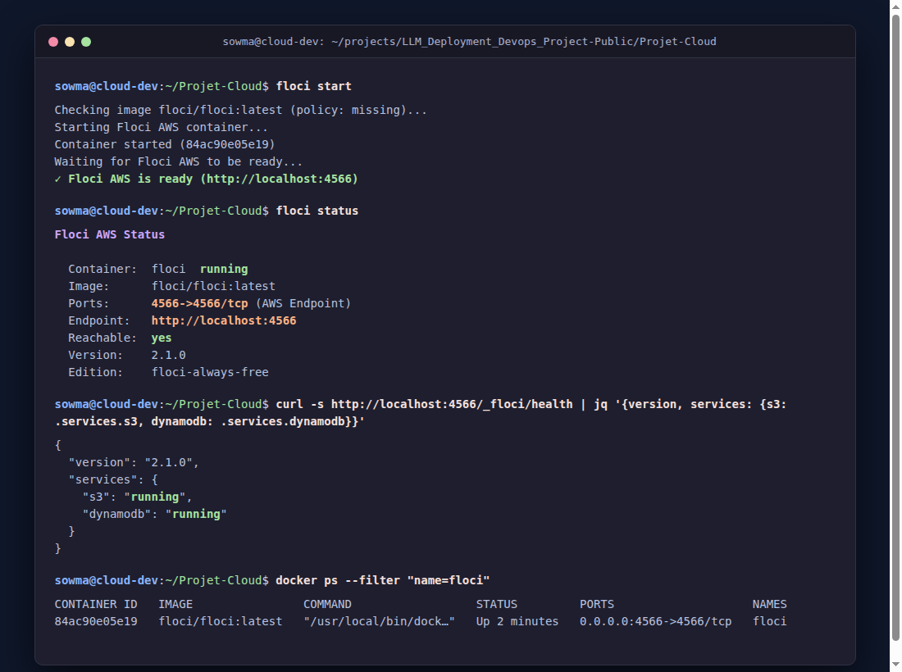
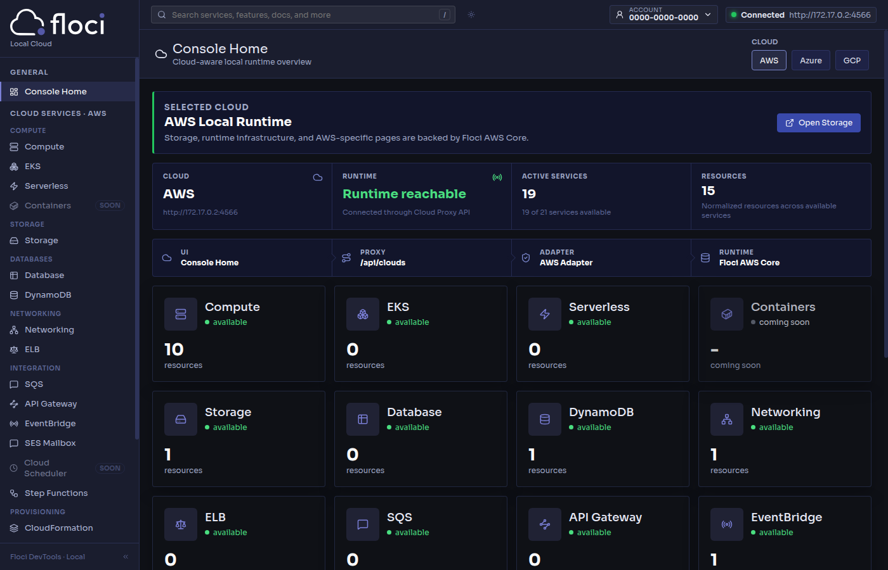

# Projet d'évaluation — Cloud, Floci et Terraform

Ce projet démontre le déploiement d'une infrastructure Cloud locale émulée avec **Floci**, visualisée via **Floci UI**, et orchestrée par **Terraform** en suivant les meilleures pratiques d'infrastructure-as-code (modularité, variables typées avec validation, locals, outputs, tests automatisés et environnements multi-cibles).

---

## 1. Choix du Cloud Provider et des Services

### Cloud Provider choisi
- **AWS (Amazon Web Services)**

### Services choisis
1. **Amazon S3 (Simple Storage Service) :** Service de stockage objet hautement disponible, sécurisé et scalable.
2. **Amazon DynamoDB :** Base de données NoSQL serverless à faible latence (clé-valeur / document).

### Justification du choix
Le binôme S3 et DynamoDB constitue le socle standard des architectures cloud-natives et serverless sur AWS :
- **S3** permet le stockage persistant de données non structurées ou semi-structurées (fichiers, images, logs, jeux de données, sauvegardes).
- **DynamoDB** gère les données transactionnelles et les métadonnées avec un modèle de partitionnement distribué à haute performance.
Ce choix permet d'illustrer la gestion conjointe d'un service de stockage objet et d'une base de données managée au sein d'un même projet d'Infrastructure-as-Code Terraform.

---

## 2. Architecture du Projet

```text
Projet-Cloud/
│
├── README.md                 # Documentation complète du projet
├── versions.tf               # Version minimale de Terraform et source du provider AWS
├── providers.tf              # Configuration du provider AWS redirigé vers Floci
├── variables.tf              # Déclaration des variables racine avec validations strictes
├── terraform.tfvars          # Fichier de variables appliqué par défaut
├── locals.tf                 # Définition des expressions locales (préfixes, tags standards)
├── main.tf                   # Déploiement et instanciation des modules
├── outputs.tf                # Outputs racine exposant les identifiants et ARNs des ressources
│
├── environments/             # Configurations pour plusieurs environnements (Bonus)
│   ├── dev.tfvars            # Variables pour l'environnement de développement
│   └── prod.tfvars           # Variables pour l'environnement de production
│
├── modules/                  # Modules Terraform réutilisables
│   ├── s3/
│   │   ├── main.tf           # Ressource aws_s3_bucket
│   │   ├── variables.tf      # Variables d'entrée du module S3
│   │   ├── outputs.tf        # Identifiant et ARN du bucket
│   │   └── README.md         # Documentation générée par terraform-docs (Bonus)
│   │
│   └── dynamodb/
│       ├── main.tf           # Ressource aws_dynamodb_table
│       ├── variables.tf      # Variables d'entrée du module DynamoDB
│       ├── outputs.tf        # Nom, identifiant et ARN de la table
│       └── README.md         # Documentation générée par terraform-docs (Bonus)
│
├── tests/                    # Tests automatisés natifs Terraform (Bonus)
│   └── main.tftest.hcl       # Assertions sur les noms des ressources calculés
│
└── screenshots/              # Captures d'écran justificatives
    ├── floci.png             # Floci CLI en fonctionnement (port 4566, healthcheck)
    ├── floci-ui.png          # Floci UI démarrée sur le port 4500
    ├── resources.png         # Floci UI avec les ressources S3 et DynamoDB actives (1 de chaque)
    └── destroy.png           # Floci UI après terraform destroy (0 ressource)
```

---

## 3. Lancement de Floci et Floci UI

### 3.1 Démarrage de Floci (Étape 1)
Floci est un émulateur cloud local moderne et performant.

1. **Démarrer le conteneur Floci :**
   ```bash
   floci start
   ```
   *(Ou avec Docker : `docker run -d --name floci -p 4566:4566 -v /var/run/docker.sock:/var/run/docker.sock floci/floci:latest`)*

2. **Identifier le port et vérifier le fonctionnement :**
   - **Port AWS :** `4566`
   - **Endpoint local :** `http://localhost:4566`
   - **Vérification du statut :**
     ```bash
     floci status
     ```
   - **Vérification de la santé des services :**
     ```bash
     curl -s http://localhost:4566/_floci/health | jq '{version, services: {s3: .services.s3, dynamodb: .services.dynamodb}}'
     ```



---

### 3.2 Démarrage de Floci UI (Étape 2)
Floci UI est la console web graphique officielle de Floci.

1. **Lancer la console Floci UI :**
   Accédez simplement via un navigateur ou effectuez une requête sur :
   ```bash
   curl -s http://localhost:4566/_floci/ui
   ```
   Floci démarre automatiquement le conteneur sidecar `floci-ui` sur le port `4500`.

2. **Accès Web :**
   Ouvrez votre navigateur sur :
   ```text
   http://localhost:4500
   ```

3. **Identification :**
   - Provider : **AWS Local Runtime**
   - Services identifiés dans l'UI : **Storage (S3)** et **DynamoDB**.


---

## 4. Configuration de Terraform avec Floci (Étape 5)

### Différence entre le véritable Cloud Provider et Floci
Lors de l'utilisation de Terraform avec le véritable Cloud Provider (AWS) :
- Les requêtes HTTP/HTTPS sont acheminées vers les endpoints publics d'Amazon (`s3.amazonaws.com`, `dynamodb.us-east-1.amazonaws.com`).
- L'authentification nécessite de véritables clés API AWS (`AWS_ACCESS_KEY_ID`, `AWS_SECRET_ACCESS_KEY`) et des autorisations IAM valides.
- Chaque ressource créée engendre des coûts de facturation réels.

Avec **Floci** :
- Les requêtes sont détournées vers un **endpoint local** unique (`http://localhost:4566`) via le bloc `endpoints {}` du provider.
- La vérification des identifiants et des métadonnées AWS est désactivée (`skip_credentials_validation = true`, `skip_metadata_api_check = true`, `skip_requesting_account_id = true`).
- L'accès S3 est configuré en mode chemin d'accès (`s3_use_path_style = true`) pour éviter le besoin d'une résolution DNS locale par sous-domaine de bucket.
- Le cycle de vie est gratuit, immédiat et sans connexion Internet.

### Extrait de `providers.tf`
```hcl
provider "aws" {
  region                      = var.aws_region
  access_key                  = "mock_access_key"
  secret_key                  = "mock_secret_key"
  skip_credentials_validation = true
  skip_metadata_api_check     = true
  skip_requesting_account_id  = true
  s3_use_path_style           = true

  endpoints {
    s3       = var.floci_endpoint
    dynamodb = var.floci_endpoint
  }
}
```

---

## 5. Guide d'Exécution Step-by-Step

Exécutez les commandes suivantes depuis le dossier `Projet-Cloud/` :

### Étape 1 : Initialisation de l'environnement de travail
Télécharge le provider AWS et initialise les modules locaux :
```bash
terraform init
```

### Étape 2 : Formatage du code
Vérifie et applique le format standard HCL :
```bash
terraform fmt -recursive
```

### Étape 3 : Validation de la syntaxe et de la configuration
Valide les variables, les modules et les règles de cohérence :
```bash
terraform validate
```

### Étape 4 : Exécution des tests automatisés (Bonus)
Exécute la suite de tests natifs Terraform :
```bash
terraform test
```

### Étape 5 : Prévisualisation du plan d'exécution
Affiche les ressources qui seront provisionnées :
```bash
terraform plan
```
*(Pour tester un environnement spécifique : `terraform plan -var-file="environments/prod.tfvars"`)*

### Étape 6 : Déploiement des ressources
Applique la configuration et déploie le bucket S3 et la table DynamoDB :
```bash
terraform apply -auto-approve
```

---

## 6. Vérification des Ressources

### Dans Floci UI (Graphique)
Rendez-vous sur `http://localhost:4500` :
- Le panneau **Storage** indique **1 resource** (`cloud-project-dev-bucket`).
- Le panneau **DynamoDB** indique **1 resource** (`cloud-project-dev-table`).
- Le compteur total de ressources actives est incrémenté.



### En ligne de commande (API Floci)
1. **Lister les buckets S3 :**
   ```bash
   curl -s http://localhost:4566/
   ```
2. **Lister les tables DynamoDB :**
   ```bash
   curl -s -X POST http://localhost:4566/ \
     -H "X-Amz-Target: DynamoDB_20120810.ListTables" \
     -H "Content-Type: application/x-amz-json-1.0" \
     -d '{}'
   ```

---

## 7. Destruction Propre des Ressources (Étape 12)

Pour supprimer l'ensemble des ressources créées par Terraform :
```bash
terraform destroy -auto-approve
```

### Vérification après destruction
- Dans Floci UI (`http://localhost:4500`), les compteurs Storage et DynamoDB reviennent à **0**.
- La capture `screenshots/destroy.png` confirme la suppression intégrale des ressources.


---

## 8. Critères d'Évaluation et Bonus Implémentés

| Critère | Statut | Détails |
|---|:---:|---|
| **Floci installé et démarré** |  Validé | CLI Floci 0.2.3, conteneur Docker `floci/floci:latest`, port 4566 |
| **Floci UI fonctionnel** |  Validé | Console web accessible sur `http://localhost:4500` |
| **Choix du Provider** |  Validé | AWS |
| **2 services Cloud choisis** |  Validé | S3 & DynamoDB |
| **Terraform & provider** |  Validé | Endpoint local configuré dans `providers.tf` |
| **Variables & `terraform.tfvars`** |  Validé | Variables typées, descriptions claires, fichier de valeurs |
| **Locals & Outputs** |  Validé | `local.resource_prefix`, `local.common_tags`, outputs racine et modules |
| **Organisation en Modules** |  Validé | `modules/s3` et `modules/dynamodb` autonomes et réutilisables |
| **Cycle Terraform complet** |  Validé | `init`, `fmt`, `validate`, `plan`, `apply`, `destroy` sans erreur |
| **Vérification Floci UI** |  Validé | Captures `resources.png` et `destroy.png` |
| **Validation avancée (Bonus)** |  Validé | Blocs `validation` avec `regex`, `contains`, `length` sur variables |
| **Environnements dev/prod (Bonus)** |  Validé | Fichiers `environments/dev.tfvars` et `environments/prod.tfvars` |
| **Tests Terraform (Bonus)** |  Validé | Suite `tests/main.tftest.hcl` exécutée avec succès via `terraform test` |
| **Documentation terraform-docs (Bonus)** |  Validé | READMEs générés par `terraform-docs` dans chaque module |
