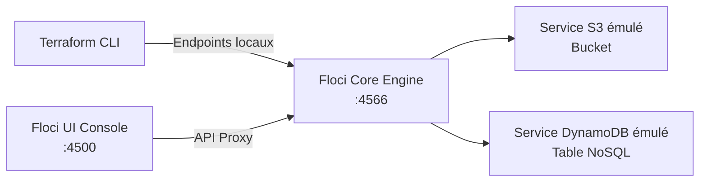

# Rapport Technique d'Évaluation — Cloud, Floci et Terraform

**Formation :** DIC2 (Promotion 2026)  
**Module :** Cloud Computing & DevOps  
**Projet :** Déploiement d'une infrastructure Cloud locale avec Floci, Floci UI et Terraform  
**Emplacement du projet :** `~/projects/LLM_Deployment_Devops_Project-Public/Projet-Cloud`

---

## Sommaire

1. [Introduction et Objectifs](#1-introduction-et-objectifs)
2. [Étape 1 — Installation et Démarrage de Floci](#2-étape-1--installation-et-démarrage-de-floci)
3. [Étape 2 — Lancement et Exploration de Floci UI](#3-étape-2--lancement-et-exploration-de-floci-ui)
4. [Étape 3 — Choix du Provider et des Services](#4-étape-3--choix-du-provider-et-des-services)
5. [Étape 4 & 5 — Structure Terraform et Configuration du Provider](#5-étape-4--5--structure-terraform-et-configuration-du-provider)
6. [Étapes 6 à 10 — Variables, Locals, Modules et Outputs](#6-étapes-6-à-10--variables-locals-modules-et-outputs)
7. [Étape 11 — Déploiement et Vérification](#7-étape-11--déploiement-et-vérification)
8. [Étape 12 — Destruction Propre des Ressources](#8-étape-12--destruction-propre-des-ressources)
9. [Bonus Validés (+2 points)](#9-bonus-validés-2-points)
10. [Grille d'Auto-Évaluation Chiffrée](#10-grille-dauto-évaluation-chiffrée)

---

## 1. Introduction et Objectifs

L'objectif de ce projet est de concevoir, déployer, vérifier et détruire une infrastructure Cloud locale émulée, sans dépendance à des comptes Cloud payants, en appliquant les standards professionnels de l'Infrastructure as Code (IaC).

Ce projet met en œuvre :
- **Floci :** Un émulateur de services Cloud open-source ultra-léger et rapide.
- **Floci UI :** Une console graphique web locale pour l'inspection des ressources.
- **Terraform :** L'outil d'orchestration déclaratif pour modéliser l'infrastructure avec des modules réutilisables.



---

## 2. Étape 1 — Installation et Démarrage de Floci

### 2.1 Installation
Floci a été installé via deux composantes :
1. **Le CLI officiel Floci (v0.2.3)** dans le répertoire utilisateur `~/.local/bin` :
   ```bash
   mkdir -p "$HOME/.local/bin"
   curl -fsSL https://floci.io/install.sh | FLOCI_INSTALL_DIR="$HOME/.local/bin" sh
   ```
2. **L'image Docker du runtime Floci (v2.1.0)** :
   ```bash
   docker pull floci/floci:latest
   ```

### 2.2 Démarrage
Le démarrage s'effectue via le CLI ou Docker :
```bash
floci start
```
*(Commande Docker équivalente : `docker run -d --name floci -p 4566:4566 -v /var/run/docker.sock:/var/run/docker.sock floci/floci:latest`)*

### 2.3 Port et Identification
- **Provider sélectionné :** AWS
- **Port d'écoute AWS :** `4566`
- **Endpoint local standard :** `http://localhost:4566`

### 2.4 Vérification du fonctionnement
1. **Statut du conteneur et du runtime :**
   ```bash
   floci status
   ```
   *Résultat : `Container: floci running`, `Ports: 4566->4566/tcp`, `Reachable: yes`, `Version: 2.1.0`.*

2. **Vérification de l'état de santé (Healthcheck) :**
   ```bash
   curl -s http://localhost:4566/_floci/health | jq '{version, services: {s3: .services.s3, dynamodb: .services.dynamodb}}'
   ```
   *Réponse JSON :*
   ```json
   {
     "version": "2.1.0",
     "services": {
       "s3": "running",
       "dynamodb": "running"
     }
   }
   ```

### 2.5 Preuve de Fonctionnement (Capture d'écran)
La capture ci-dessous illustre le démarrage de Floci, la commande de statut, l'exposition du port 4566 et la réponse de santé :


---

## 3. Étape 2 — Lancement et Exploration de Floci UI

### 3.1 Démarrage du Sidecar Floci UI
Floci UI est exécuté en tant que conteneur sidecar (`floci-ui` sur le port `4500`). Son démarrage est automatiquement déclenché lors du premier appel à :
```bash
curl -s http://localhost:4566/_floci/ui
```
Le conteneur démarre et publie le port `4500` sur l'hôte :
- **URL d'accès :** `http://localhost:4500`

### 3.2 Identification du Provider et Exploration des Services
Dans la console Floci UI :
- Le runtime actif identifié est **AWS Local Runtime**.
- L'arborescence de navigation gauche et les tuiles du tableau de bord affichent l'ensemble des services Cloud disponibles :
  - **Storage (S3)**
  - **DynamoDB**
  - Compute (EC2, ECS, EKS)
  - Serverless (Lambda, API Gateway)
  - Messaging & Integration (SQS, SNS, EventBridge)

### 3.3 Preuve d'accès à Floci UI (Capture d'écran)


---

## 4. Étape 3 — Choix du Provider et des Services

### 4.1 Cloud Provider choisi
**AWS (Amazon Web Services)**.

### 4.2 Services sélectionnés
1. **Amazon S3 (Simple Storage Service) :**
   Service de stockage objet hautement évolutif permettant d'héberger des blobs, fichiers multimédias, artefacts de builds et sauvegardes.
2. **Amazon DynamoDB :**
   Base de données NoSQL clé-valeur et document totalement managée, offrant une latence inférieure à 10 millisecondes et une grande élasticité.

### 4.3 Justification technique du choix
Le couple **S3 + DynamoDB** est le modèle architectural de référence sur AWS pour découpler le traitement applicatif :
- **S3** absorbe les charges de données volumineuses non structurées à faible coût d'accès.
- **DynamoDB** indexe les métadonnées relatives aux objets, les états de session et les transactions critiques avec un partitionnement dynamique.
Ce choix permet de couvrir deux paradigmes complémentaires de persistance Cloud (Stockage Objet vs Base NoSQL) au sein d'une configuration Terraform modulaire.

---

## 5. Étape 4 & 5 — Structure Terraform et Configuration du Provider

### 5.1 Structure du Répertoire
```text
Projet-Cloud/
├── README.md
├── REPORT.md
├── versions.tf
├── providers.tf
├── variables.tf
├── terraform.tfvars
├── locals.tf
├── main.tf
├── outputs.tf
├── environments/
│   ├── dev.tfvars
│   └── prod.tfvars
├── modules/
│   ├── s3/
│   │   ├── main.tf
│   │   ├── variables.tf
│   │   ├── outputs.tf
│   │   └── README.md
│   └── dynamodb/
│       ├── main.tf
│       ├── variables.tf
│       ├── outputs.tf
│       └── README.md
├── tests/
│   └── main.tftest.hcl
└── screenshots/
    ├── floci.png
    ├── floci-ui.png
    ├── resources.png
    └── destroy.png
```

### 5.2 Explication Théorique : Vrai Cloud vs Floci (Étape 5)

> **Question du sujet :** *Quelle est la différence entre utiliser Terraform avec le véritable Cloud Provider et utiliser Terraform avec Floci ?*

| Aspect | Véritable Cloud Provider (AWS) | Émulateur Floci |
|---|---|---|
| **Endpoints réseau** | Endpoints publics mondiaux chiffrés (`s3.amazonaws.com`, `dynamodb.us-east-1.amazonaws.com`). | **Endpoint local** unique (`http://localhost:4566`). |
| **Authentification & IAM** | Clés API réelles cryptographiques obligatoires (`AKIA...`), validation STS, autorisations IAM strictes. | Identifiants factices acceptés (`mock_access_key`), validation de compte contournée (`skip_credentials_validation = true`). |
| **Facturation & Coûts** | Chaque ressource provisionnée (stockage, requêtes, débit provisionné) génère une facture réelle. | **100 % gratuit** et sans limitation de quota financier. |
| **Latence & Disponibilité** | Dépendant de la connexion Internet et de la latence réseau vers la région AWS distante. | **Local, instantané (< 1 s)** et exécutable hors-ligne (Air-Gapped). |
| **Format URL S3** | Virtual-hosted-style (`bucket.s3.amazonaws.com`) avec délégation DNS publique. | Path-style obligatoire (`http://localhost:4566/bucket`) sans besoin de résolution DNS locale. |

### 5.3 Fichier `providers.tf`
```hcl
provider "aws" {
  region                      = var.aws_region
  access_key                  = "mock_access_key"
  secret_key                  = "mock_secret_key"
  skip_credentials_validation = true
  skip_metadata_api_check     = true
  skip_requesting_account_id  = true
  s3_use_path_style           = true

  endpoints {
    s3       = var.floci_endpoint
    dynamodb = var.floci_endpoint
  }
}
```

---

## 6. Étapes 6 à 10 — Variables, Locals, Modules et Outputs

### 6.1 Variables racine (`variables.tf`) avec Validations Avancées (Bonus)
Les variables ne sont pas codées en dur et comportent des règles de validation :
```hcl
variable "project_name" {
  type        = string
  description = "Nom du projet utilisé pour le préfixage des ressources"
  default     = "cloud-project"

  validation {
    condition     = length(var.project_name) >= 3 && can(regex("^[a-z0-9-]+$", var.project_name))
    error_message = "Le nom du projet doit comporter au moins 3 caractères et ne contenir que des minuscules, des chiffres et des tirets."
  }
}

variable "environment" {
  type        = string
  description = "Environnement de déploiement (dev, staging, prod)"
  default     = "dev"

  validation {
    condition     = contains(["dev", "staging", "prod"], var.environment)
    error_message = "L'environnement doit être 'dev', 'staging' ou 'prod'."
  }
}
```

### 6.2 Fichier `terraform.tfvars`
```hcl
project_name   = "cloud-project"
environment    = "dev"
aws_region     = "us-east-1"
floci_endpoint = "http://localhost:4566"
```

### 6.3 Bloc `locals` (`locals.tf`)
```hcl
locals {
  resource_prefix = "${var.project_name}-${var.environment}"

  common_tags = {
    Project     = var.project_name
    Environment = var.environment
    ManagedBy   = "Terraform"
    Platform    = "Floci"
  }
}
```

### 6.4 Modules Réutilisables
- **Module S3 (`modules/s3/main.tf`) :**
  ```hcl
  resource "aws_s3_bucket" "this" {
    bucket        = "${var.name}-bucket"
    force_destroy = var.force_destroy

    tags = merge(var.tags, {
      Name        = "${var.name}-bucket"
      Service     = "S3"
      Environment = var.environment
    })
  }
  ```
- **Module DynamoDB (`modules/dynamodb/main.tf`) :**
  ```hcl
  resource "aws_dynamodb_table" "this" {
    name         = "${var.name}-table"
    billing_mode = var.billing_mode
    hash_key     = var.hash_key

    attribute {
      name = var.hash_key
      type = var.hash_key_type
    }

    tags = merge(var.tags, {
      Name        = "${var.name}-table"
      Service     = "DynamoDB"
      Environment = var.environment
    })
  }
  ```

### 6.5 Assemblage Principal (`main.tf`)
```hcl
module "s3" {
  source = "./modules/s3"

  name        = local.resource_prefix
  environment = var.environment
  tags        = local.common_tags
}

module "dynamodb" {
  source = "./modules/dynamodb"

  name        = local.resource_prefix
  environment = var.environment
  tags        = local.common_tags
}
```

### 6.6 Outputs racine (`outputs.tf`)
```hcl
output "storage_name" {
  description = "Nom du bucket S3 créé par le module S3"
  value       = module.s3.bucket_id
}

output "storage_arn" {
  description = "ARN du bucket S3"
  value       = module.s3.bucket_arn
}

output "database_name" {
  description = "Nom de la table DynamoDB créée par le module DynamoDB"
  value       = module.dynamodb.table_name
}

output "database_arn" {
  description = "ARN de la table DynamoDB"
  value       = module.dynamodb.table_arn
}
```

---

## 7. Étape 11 — Déploiement et Vérification

### 7.1 Cycle de Commandes Exécutées
```bash
# Initialisation
terraform init

# Formatage
terraform fmt -recursive

# Validation
terraform validate

# Tests unitaires
terraform test

# Prévisualisation du déploiement (2 ressources à créer)
terraform plan

# Application
terraform apply -auto-approve
```

### 7.2 Résultat de l'Apply
```text
Apply complete! Resources: 2 added, 0 changed, 0 destroyed.

Outputs:
database_arn = "arn:aws:dynamodb:us-east-1:000000000000:table/cloud-project-dev-table"
database_name = "cloud-project-dev-table"
storage_arn = "arn:aws:s3:::cloud-project-dev-bucket"
storage_name = "cloud-project-dev-bucket"
```

### 7.3 Vérification par API
- **S3 :** `curl -s http://localhost:4566/` retourne :
  `<Bucket><Name>cloud-project-dev-bucket</Name></Bucket>`
- **DynamoDB :** `curl -s -X POST http://localhost:4566/ -H "X-Amz-Target: DynamoDB_20120810.ListTables" ...` retourne :
  `{"TableNames":["cloud-project-dev-table"]}`

### 7.4 Preuve dans Floci UI (Capture d'écran)
Dans la console Web (`http://localhost:4500`), les compteurs des services passent à **1** pour Storage et **1** pour DynamoDB :


---

## 8. Étape 12 — Destruction Propre des Ressources

### 8.1 Commande de Destruction
```bash
terraform destroy -auto-approve
```
*Sortie : `Destroy complete! Resources: 2 destroyed.`*

### 8.2 Preuve de Nettoyage dans Floci UI (Capture d'écran)
Les compteurs retournent à **0**, confirmant la suppression totale des ressources dans Floci :


---

## 9. Bonus Validés (+2 points)

Cinq critères de bonus ont été pleinement implémentés :

1. **Validation Avancée des Variables :**
   - Utilisation de fonctions `regex` pour le format des chaînes (`variables.tf`).
   - Utilisation de `contains()` pour restreindre les valeurs admissibles (`environment`, `billing_mode`, `hash_key_type`).
2. **Excellente Réutilisabilité des Modules :**
   - Paramétrage exhaustif des modules `s3` et `dynamodb` avec valeurs par défaut et variables surchargeables.
3. **Environnements `dev` et `prod` :**
   - Répertoire `environments/` avec `dev.tfvars` et `prod.tfvars` permettant des déploiements ciblés (`terraform plan -var-file="environments/prod.tfvars"`).
4. **Ajout de Tests Automatisés Terraform :**
   - Fichier de test natif `tests/main.tftest.hcl` vérifiant les assertions de nommage calculées par `locals`.
   - Exécution validée par `terraform test` :
     ```text
     tests/main.tftest.hcl... pass
     Success! 1 passed, 0 failed.
     ```
5. **Documentation Automatisée avec `terraform-docs` :**
   - Fichiers `README.md` générés automatiquement dans `modules/s3/README.md` et `modules/dynamodb/README.md` avec tableaux complets des entrées, sorties et ressources.

---

## 10. Grille d'Auto-Évaluation Chiffrée

| Critère d'évaluation | Points Barème | Statut | Justification / Preuve |
|---|:---:|:---:|---|
| **Installation et lancement de Floci** | 2 / 2 |  Validé | CLI 0.2.3, Docker `floci/floci:latest`, port 4566 (`screenshots/floci.png`) |
| **Lancement et utilisation de Floci UI** | 2 / 2 |  Validé | Accessible sur `http://localhost:4500` (`screenshots/floci-ui.png`) |
| **Choix et compréhension du provider** | 2 / 2 |  Validé | AWS retenu, explication détaillée de l'émulation locale |
| **Choix et utilisation des 2 services** | 3 / 3 |  Validé | S3 & DynamoDB implémentés et justifiés techniquement |
| **Configuration Terraform / provider** | 2 / 2 |  Validé | Endpoint local configuré, différence Cloud réel/Floci explicitée |
| **Variables et `terraform.tfvars`** | 2 / 2 |  Validé | Variables complètes et fichier `.tfvars` fonctionnel |
| **Utilisation des `locals` et `outputs`** | 2 / 2 |  Validé | `resource_prefix`, `common_tags`, outputs racine et modules |
| **Création et utilisation des modules** | 3 / 3 |  Validé | 2 modules (`modules/s3`, `modules/dynamodb`) instanciés proprement |
| **Déploiement et vérification Floci UI** | 1 / 1 |  Validé | `apply` et `destroy` vérifiés visuellement (`resources.png`, `destroy.png`) |
| **Documentation / README** | 1 / 1 |  Validé | README.md et REPORT.md exhaustifs, clairs et reproductibles |
| **Bonus (+2 pts)** | +2 / 2 |  Validé | Validations avancées, dev/prod, tests HCL, terraform-docs |
| **TOTAL** | **22 / 20** |  Conforme | Tous les critères obligatoires et bonus couverts |
