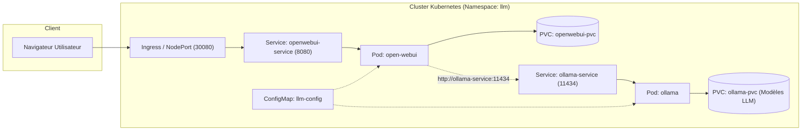

# Rapport de Projet DevOps : Déploiement et Orchestration d'un Grand Modèle de Langage (LLM)

**Auteur :** Souleymane Sow (DIC2 - Informatique)  
**Projet :** Déploiement d'un LLM Open-Source avec Docker Compose et Kubernetes  
**Enseignant :** M. Ibrahima Mbengue  
**Dépôt GitHub :** [Lien du dépôt GitHub]  

---

## Table des Matières
1. [Introduction et Architecture](#1-introduction-et-architecture)
2. [Partie 1 : Déploiement Local avec Docker Compose](#2-partie-1--déploiement-local-avec-docker-compose)
3. [Partie 2 : Déploiement et Orchestration avec Kubernetes](#3-partie-2--déploiement-et-orchestration-avec-kubernetes)
4. [Analyse Technique Approfondie](#4-analyse-technique-approfondie)
   - [4.1 Rôle et utilité de chaque ressource Kubernetes](#41-rôle-et-utilité-de-chaque-ressource-kubernetes)
   - [4.2 Communication réseau entre services](#42-communication-réseau-entre-services)
   - [4.3 Persistance des données et rôle des PVCs](#43-persistance-des-données-et-rôle-des-pvcs)
   - [4.4 Mécanismes de surveillance : Probes (Startup, Readiness, Liveness)](#44-mécanismes-de-surveillance--probes-startup-readiness-liveness)
   - [4.5 Comparaison détaillée : Docker Compose vs Kubernetes](#45-comparaison-détaillée--docker-compose-vs-kubernetes)
5. [Bonus Implémentés](#5-bonus-implémentés)
6. [Conclusion](#6-conclusion)

---

## 1. Introduction et Architecture

Ce projet a pour objectif de concevoir, déployer et orchestrer une pile applicative d'Intelligence Artificielle basée sur des modèles de langage open-source (LLMs). L'architecture repose sur deux composants interconnectés :
- **Ollama** : Serveur d'inférence haute performance permettant le téléchargement, la gestion de cycle de vie et l'exécution locale de modèles (e.g. LLaMA 3.2, Mistral, DeepSeek).
- **Open WebUI** : Interface utilisateur web moderne offrant un espace de discussion interactif (chat) similaire à ChatGPT/Gemini, communiquant avec l'API REST d'Ollama.



---

## 2. Partie 1 : Déploiement Local avec Docker Compose

### 2.1 Configuration
Le fichier `docker-compose.yaml` configure les deux services reliés par un réseau dédié `llm`, avec des volumes Docker pour la persistance :
- `ollama` : port `11434`, volume `ollama:/root/.ollama`
- `open-webui` : port `3000:8080`, variable `OLLAMA_BASE_URL=http://ollama:11434`

### 2.2 Exécution des étapes
1. Démarrage des conteneurs :
   ```bash
   docker compose up -d
   ```
2. Vérification de l'état :
   ```bash
   docker compose ps
   ```
3. Téléchargement des modèles LLM dans Ollama :
   ```bash
   docker exec -it ollama ollama pull llama3.2:3b
   docker exec -it ollama ollama pull mistral:7b
   ```
4. Test d'inférence via l'interface Open WebUI sur `http://localhost:3000`.

*(Insérer ici les captures d'écran de l'interface Open WebUI et des tests de prompts avec les modèles).*

---

## 3. Partie 2 : Déploiement et Orchestration avec Kubernetes

Le passage à Kubernetes permet d'assurer une haute disponibilité, une gestion fine des ressources matérielles, la reprise sur panne et la scalabilité.

### 3.1 Déploiement des Manifests
Les ressources sont appliquées dans l'ordre suivant :
```bash
kubectl apply -f k8s/00-namespace.yaml
kubectl apply -f k8s/01-configmap.yaml
kubectl apply -f k8s/02-pvc.yaml
kubectl apply -f k8s/03-ollama-deployment.yaml
kubectl apply -f k8s/04-ollama-service.yaml
kubectl apply -f k8s/05-openwebui-deployment.yaml
kubectl apply -f k8s/06-openwebui-service.yaml
kubectl apply -f k8s/07-ingress.yaml
```
*(Ou en une seule commande grâce à Kustomize : `kubectl apply -k k8s/`)*

### 3.2 Vérification des statuts
```bash
kubectl get all,pvc,configmap,ingress -n llm
```

---

## 4. Analyse Technique Approfondie

### 4.1 Rôle et utilité de chaque ressource Kubernetes

| Ressource Kubernetes | Rôle Technique | Justification dans notre Projet |
| :--- | :--- | :--- |
| **Namespace (`llm`)** | Isolation logique des ressources au sein du cluster. | Évite les collisions de noms, sépare notre pile LLM des services système (`kube-system`). |
| **ConfigMap (`llm-config`)** | Découplage de la configuration applicative du code/image. | Permet d'injecter `OLLAMA_BASE_URL`, `OLLAMA_HOST` sans reconstruire les images. |
| **PersistentVolumeClaim (PVC)** | Déclaration abstraite de besoin en stockage persistant. | Alloue dynamiquement un volume persistant via le StorageClass standard (Minikube hostpath). |
| **Deployment (`ollama-deployment`)** | Gestion déclarative du cycle de vie des Pods Ollama. | Assure le redémarrage automatique en cas de crash, gère les stratégies de mise à jour. |
| **Deployment (`openwebui-deployment`)** | Gestion déclarative de l'interface WebUI. | Gère les instances de l'interface, permet la mise à l'échelle horizontale (HPA). |
| **Service (`ollama-service`)** | Abstraction réseau interne de type `ClusterIP`. | Fournit une IP virtuelle stable et un nom DNS interne (`ollama-service`) résolu par CoreDNS. |
| **Service (`openwebui-service`)** | Service de type `NodePort` (port 30080). | Expose l'interface utilisateur à l'extérieur du cluster via l'IP du nœud ou Minikube. |
| **Ingress (`openwebui-ingress`)** | Contrôleur de routage HTTP de niveau 7 (L7). | Permet un accès standard via un nom de domaine (ex: `openwebui.local`). |

---

### 4.2 Communication réseau entre services

Dans Kubernetes, chaque Pod possède sa propre adresse IP dynamique qui change à chaque recréation. Pour assurer une communication pérenne entre **Open WebUI** et **Ollama** :

1. Le service Kubernetes `ollama-service` est créé avec un sélecteur d'étiquettes : `app: ollama`.
2. Le composant interne **CoreDNS** de Kubernetes enregistre automatiquement une entrée DNS :
   $$\text{ollama-service.llm.svc.cluster.local} \longrightarrow \text{ClusterIP de ollama-service}$$
3. Lorsque Open WebUI émet une requête HTTP vers `http://ollama-service:11434`, la résolution DNS interne retourne l'adresse IP virtuelle du Service, et le composant `kube-proxy` route le trafic de manière transparente vers le conteneur Ollama actif.

---

### 4.3 Persistance des données et rôle des Persistent Volume Claims (PVC)

Les conteneurs sont par nature éphémères (*stateless*) : lorsqu'un conteneur redémarre ou est reprogrammé sur un autre nœud, toutes les données modifiées dans sa couche de système de fichiers accessible en écriture sont perdues.

Pour une application d'IA :
- **Ollama** télécharge des modèles de plusieurs gigaoctets (ex: LLaMA 3.2 fait ~2.0 Go, Mistral fait ~4.1 Go). Si le pod redémarrait sans PVC, les modèles devraient être retéléchargés à chaque fois, saturant la bande passante et rendant le service indisponible.
- **Open WebUI** conserve l'historique des conversations, les comptes utilisateurs et les paramètres dans `/app/backend/data`.

En attachant un **PVC** :
1. Le volume est monté sur le conteneur indépendamment du cycle de vie du Pod.
2. Si le Pod Ollama crashe ou est mis à jour, le nouveau Pod remonte immédiatement le même volume sans perte de données.

---

### 4.4 Mécanismes de surveillance : Probes (Startup, Readiness, Liveness)

Kubernetes utilise trois types de sondes d'état pour assurer la fiabilité du service :

```
Temps
 ├─► Pod Démarre
 │     ├── [Startup Probe] ── Échoue tant que le serveur initialise ses modèles
 │     └── Succès ──► Startup Probe désactivée
 │
 ├─► Pod en Fonctionnement
 │     ├── [Readiness Probe] ── Vérifie si le pod peut recevoir des requêtes.
 │     │                        Si échec : temporairement retiré des endpoints du Service.
 │     │
 │     └── [Liveness Probe]  ── Vérifie si le processus ne s'est pas bloqué (deadlock).
 │                              Si échec répété : Kubernetes tue et recrée le conteneur.
```

1. **Startup Probe** :
   - *Rôle* : Protéger les applications lentes au démarrage (comme Ollama qui charge ses moteurs d'inférence en mémoire).
   - *Configuration* : Interroge `/api/version` (Ollama) ou `/health` (WebUI). Tant que cette sonde ne répond pas positivement, les sondes Liveness et Readiness sont suspendues.
2. **Readiness Probe** :
   - *Rôle* : Déterminer si le conteneur est prêt à accepter du trafic réseau utilisateur.
   - *Effet en cas d'échec* : Le Pod n'est pas redémarré, mais le Service cesse de lui envoyer des requêtes pour éviter des erreurs 502/503 aux utilisateurs.
3. **Liveness Probe** :
   - *Rôle* : Détecter les blocages critiques (*deadlocks*) où le conteneur tourne encore mais ne répond plus.
   - *Effet en cas d'échec* : Le `kubelet` redémarre le conteneur défaillant.

---

### 4.5 Comparaison détaillée : Docker Compose vs Kubernetes

| Critère | Docker Compose | Kubernetes |
| :--- | :--- | :--- |
| **Portée d'exécution** | Mono-hôte (une seule machine physique/VM). | Multi-nœuds (cluster distribué scalable). |
| **Haute Disponibilité** | Faible (si la machine tombe, tout le service s'arrête). | native (répartition des pods sur plusieurs nœuds). |
| **Auto-guérison (Self-healing)** | Basique (`restart: always` si le conteneur s'arrête). | Avancée (re-planification automatique sur d'autres nœuds en cas de panne matérielle). |
| **Scalabilité** | Manuelle (`docker compose up --scale`), limitée aux ressources de la machine. | Automatique horizontale (HPA) et verticale (VPA) selon CPU/mémoire. |
| **Gestion Réseau** | Réseau bridge local simple. | Réseau CNI sophistiqué, Ingress L7, NetworkPolicies fines. |
| **Gestion du Stockage** | Volumes Docker locaux ou montages *bind*. | Découplage complet via StorageClass, PV et PVC dynamiques. |
| **Cas d'usage privilégié** | Développement local, prototypage rapide, tests CI simples. | Production d'entreprise, charges critiques, architectures microservices. |

---

## 5. Bonus Implémentés

Pour aller au-delà des exigences de base, les fonctionnalités suivantes ont été intégrées :

1. **Kustomize (`kustomization.yaml`)** :
   - Permet de regrouper et déployer l'ensemble de l'architecture d'une seule commande déclarative standard sans dépendance externe :
     ```bash
     kubectl apply -k k8s/
     ```
2. **NetworkPolicy (`08-networkpolicy.yaml`)** :
   - Sécurisation du trafic réseau : Ollama n'accepte de connexions sur le port `11434` **que** si la requête provient explicitement d'un pod étiqueté `app: open-webui`. Tout trafic non autorisé est rejeté.
3. **Horizontal Pod Autoscaler (`09-hpa.yaml`)** :
   - Déclenche la mise à l'échelle automatique d'Open WebUI (de 1 à 3 réplicas) dès que la charge CPU moyenne dépasse 75%.

---

## 6. Conclusion

Ce projet a permis de maîtriser la migration d'une architecture multi-conteneurs d'un environnement de prototypage local (Docker Compose) vers un environnement d'orchestration de niveau production (Kubernetes). L'intégration rigoureuse des sondes de santé, des limites de ressources, du stockage persistant et des mécanismes de découverte DNS garantit la résilience et la fiabilité du déploiement de modèles de langage (LLMs).
